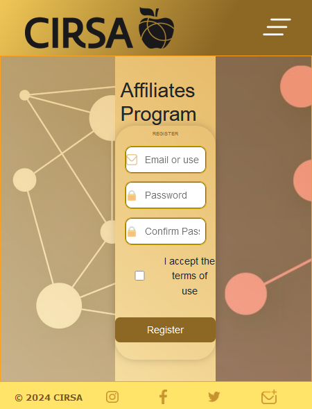
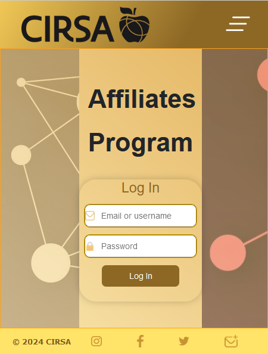

# Cirsa Tech Hub  
## Test Nombre de usuario: exampleUsername  
## Test Contraseña: qwertyuiop  
[https://menudopaio.github.io/CirsaDesdeCero](https://menudopaio.github.io/CirsaDesdeCero)

## INDICE:
- [Background](#Background)
- [Instalación](#Instalacion)
   1. [Prerequisitos](#Prerequisitos)
   2. [Clonar el repositorio](#Clonar-el-repositorio)
   3. [Cambiar la etiqueta base](#Cambiar-la-etiqueta-base)
   4. [Compilar y ejecutar](#Compilar-y-ejecutar)
- [Modo de uso y ejemplos](#Modo-de-uso-y-ejemplos)

### Background

*CIRSA busca expandirse y ha creado un programa de afiliados para que también gane la persona que les ayude. Para poder llevarlo a cabo, se necesitan desarrolladores capaces de crear una aplicación web innovadora y con buen diseño. Es por esto que se pide crear varias vistas que encajen con el diseño de CIRSA y que resuelva este problema.*

*El stack propuesto para este reto es C# y Blazor como framework.*

Empecé esta pagina web sin ningun conocimiento previo de .Net o Blazor, pero aprenderlos a usar no ha sido el reto. La parte mas difícil de este proyecto ha sido desplegarlo con éxito en github pages. Ha sido una odisea darme cuenta de qué estaba fallando; solamente siguiendo los errores no me ayudaba en ningun sentido, hasta que encontré [EL](https://www.youtube.com/watch?v=nNxII6jvPvQ) video.

El asunto principal con github pages y las aplicaciones Blazor es que:

1. Github modifica algunos archivos en el despliegue.  
   --> En la raíz del proyecto, en la terminal, ejecuta: `"* binary >> .attributes`  
   El archivo `.attributes` dirá a github que trate todos los archivos como archivos binarios, así que no los modificará.
   
2. Github trata algunos archivos como jekyll.  
   --> En el directorio raíz, crea un archivo vacío llamado `.nojekyll`.  
   Esto prevendra que github trate algunos archivos autogenerados como jekyll.

3. Las rutas son distintas cuando se ejecuta en localhost o en github pages.  
   --> En la etiqueta `<base>` en `index.html`, cambia `("/")` por `("/NombreDeTuProyecto/")`.  
   Github despliega tu pagina web en `nombreDeUsuario.github.io/NombreDeTuProyecto`, asi que la raíz de tu proyecto es esta.

El último contratiempo que tuve fue crear el workflow (flujo de trabajo). Antes de este proyecto ni siquiera sabia que existían. Son muy potentes, pero como cualquier cosa, debes saber como usarlos. Lo resolví mirando varios proyectos blazor de otras personas para entender qué estaba pasando, y también mirando varios videos (encontrando la solución otra vez en [EL](https://www.youtube.com/watch?v=nNxII6jvPvQ) mismo video de antes.) Todo en 16 minutos. La cuestión era encontrarlo!

Paara crear un workflow, tienes que automatizar el proceso completo de lo que harias manualmente: entrar en la rama que contiene el proyecto, configurar dotnet, instalar herramientas webAssembly, publicarlo, y "comprometerlo" (commit) a github pages utilizando tu token de acceso personal (PAT). Finalmente tambien añadí al workflow la creación del archivo .nojekyll, así como el archivo 404.html y la cuestión de las rutas, como hacía en el video, pero no es necesario automatizar esto.

Como es una página web estática sin backend, ninguna de la información proporcionada en cualquier formulario va a ser guardada o procesada.

### Instalacion

Para instalar y ejecutar este proyecto Blazor WebAssembly en tu entorno local, sigue estos pasos:

#### Prerequisitos

* Asegurate de tener instalado .NET SDK en tu sistema. Se recomienda usar la version 8.0.100 o superior.  
* Necesitarás un editor de código como Visual Studio Code o Visual Studio para trabajar con el proyecto.

#### Clonar el repositorio

Clona este repositorio a tu maquina local usando Git:

`git clone https://github.com/menudopaio/CirsaDesdeCero.git`

Entra en el directorio raíz del proyecto:

`cd CirsaDesdeCero`

#### Cambia la etiqueta base:

En `index.html`, dentro de `wwwroot`, comenta la etiqueta de GITHUB, y descomenta la etiqueta de LOCALHOST señaladas con comentarios.

#### Compilar y ejecutar:

Abre una terminal en la raíz del proyecto y ejecuta el siguiente comando para construir y ejecutar el proyecto:

`dotnet run´

Esto construira el proyecto y lo ejecutara localmente. Una vez iniciado, puedes acceder a la aplicacion a traves del navegador en el localhost proporcionado por tu IDE.

### Modo de uso y ejemplos

Desde la pagina principal `Home`, puedes registrarte haciendo click en el boton `Register`, o a través del botón `Join In`. En la pagina principal, tambien encontramos links a algunos departamentos externos de la compañía, como otros productos, contactos, media, o noticias. Registrarse no es posible, pero puedes utilizar el nombre de usuario y contraseña proporcionados para ver las funcionalidades que tiene la pagina web. 

Una vez logueado, puedes ver una dashboard con alguna información sobre tu cuenta, como tu link de afiliado, cuanta gente se ha registrado a través de tu link, tu actual balance, desde donde estan comprando tus productos, y otra información útil. Por supuesto, toda la información son sólo variables, pues no podemos acceder a una base de datos desde github.

Aparte de la información de tu cuenta, hay una sección para editar algunos estilos de tu pagina de dashboard. También seran aplicados a la pagina de registro a través de tu link de afiliado. Haciendo click en la imagen de la esquina superior izquierda, puedes modificar la fuente, color y grosor de algunos textos de tu dashboard y de la pagina de registro de tus clientes, asi como el color de fondo del dashboard y de la pagina de registro, con algunos menus desplegables. Tambien puedes editar la bienvenida para la pagina de registro. Como cuelquier otro formulario en github, esto no sera guardado.

Haciendo click en el boton `Check View`, puedes ver como queda la pagina de registro del cliente.

O haciendo click en el boton `Save`, puedes ver como queda el dashboard.

Finalmente, puedes compartir tu link de afiliado para que cualquiera puede registrarse a través de esta reestilizada página, y comprar productos haciéndote ganar una comisión por cada venta.

Algunas muestras más:

Otros tamaños de pantalla:

