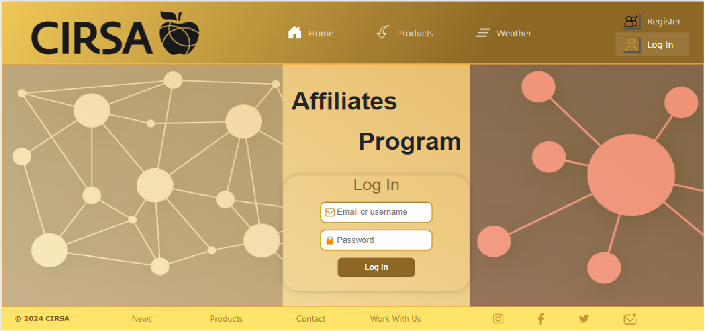
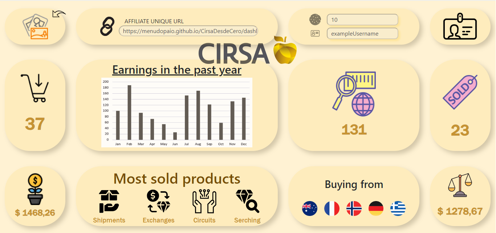
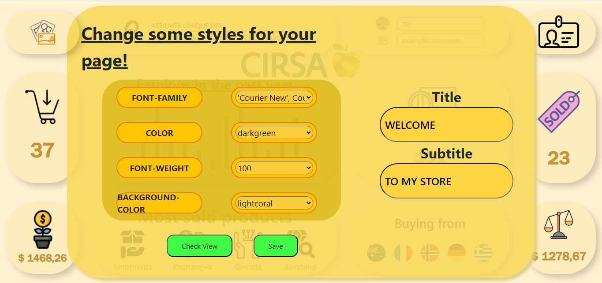
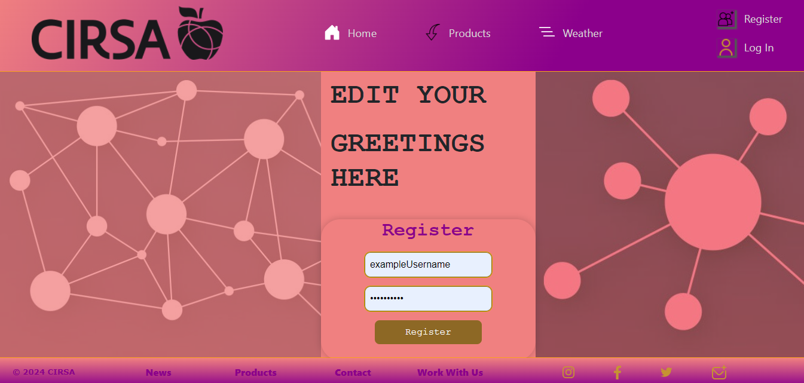

# Cirsa Tech Hub
## Test Username: exampleUsername
## Test Password: qwertyuiop
[https://menudopaio.github.io/CirsaDesdeCero](https://menudopaio.github.io/CirsaDesdeCero)

I started this webpage with no prior knowledge on .Net or Blazor, but learning to use them was not a big deal. The hardest part of this project has been deploying it succesfully to github pages. It has been an ardous work to realize what was failling; just following the errors couldn't help me, until I found [THE](https://www.youtube.com/watch?v=nNxII6jvPvQ) video.

The main issue with github pages and Blazor applications is that:
1. Github modifies some files when deploying.
   --> In the root of the project, in the terminal, execute: ` "* binary" >> .attributes `
   The `.attributes` file will tell github to treat all files as binary files, so it will not modify them.
   
2. Github treats some files as jekyll files.
   --> In the root directory, create an empty file named `.nojekyll`
   This will prevent github to treat some autogenerated files as jekyll.

3. The routes are not the same when running on localhost or on github pages.
   --> In the `<base>` tag in `index.html`, change `("/")` for `("/YourProjectName/")`
   Github deploys your webpage on `username.github.io/YourProjectName`, so your root is this one, instead.

The last setback I had was creating a workflow. Before this project I even didn't know about their existence. They are very powerfull, but as with anything, you need to know how to use them. I solved this by checking many people's blazor projects to understand what was going on, and also watching many videos (finding the solution again in [THE](https://www.youtube.com/watch?v=nNxII6jvPvQ) same video as before.) All in 16 minutes. The issue was to find it!

For creating a workflow, you need to automate the whole process of what you would do yourself: checkout the branch that contains the project, setup dotnet, install wasm tools, publish it and commit it to github pages using your personal access token. In my case I finally also added to the workflow the creation of the .nojekyll file and the 404 file and the routes issue, as in the video, but it's not needed to automate this.

Since this is a static webpage with no backend, none of the information provided here in any form is going to be stored.

### Webpage flow
From the `Home` page, you can register by either clicking on the `Register` button or by the `Join In` button. In the home page we also find links to some company external departments, such as other products, contact, media, or news. Registering is not possible, but you can use the provided username and password  to log in and check the website functionalities.
 

 

 

 
Once you log in, you can see a dashboard with some of the information of your account, like your unique affiliate link, how many people registered through your link, your current balance, where is people buying your products from, and other useful information. Of course, all the information is just sample variables, since we cannot access a database from github.
 

 
Besides all of your account information, there is a section to edit some styles of your dashboard page. They will also apply to your registration affilliate link. Clicking on the top left corner image you can change the font family, color and font weight of part of the text in your dashboard and the affilliates registration page, as long as the background color of the dashboard and the affiliates registration page, from some dropdown options. As with any other `form` in github, this will not save the changes.
 

 
By clicking on the Check View button, you can see how the client register page is styled.
 

 
Or by clicking on the Save button, you can see how the dashboard is combined.
 

 

Finally, you can share your unique affiliate link, so anyone can register through this new styled page, and buy products making you earn a comission for each sale.
