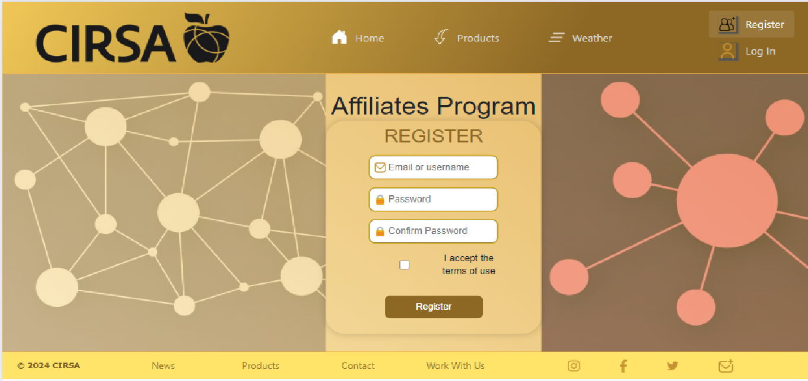
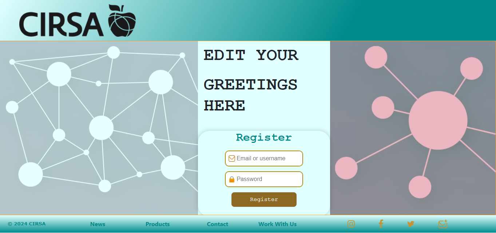
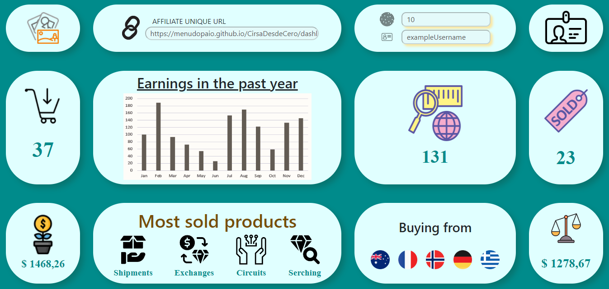
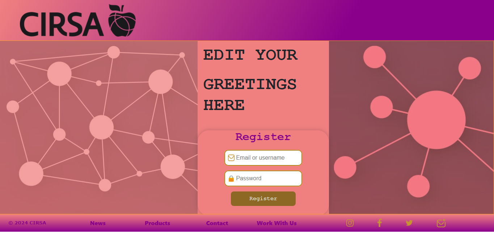
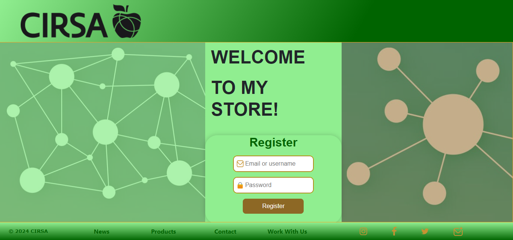
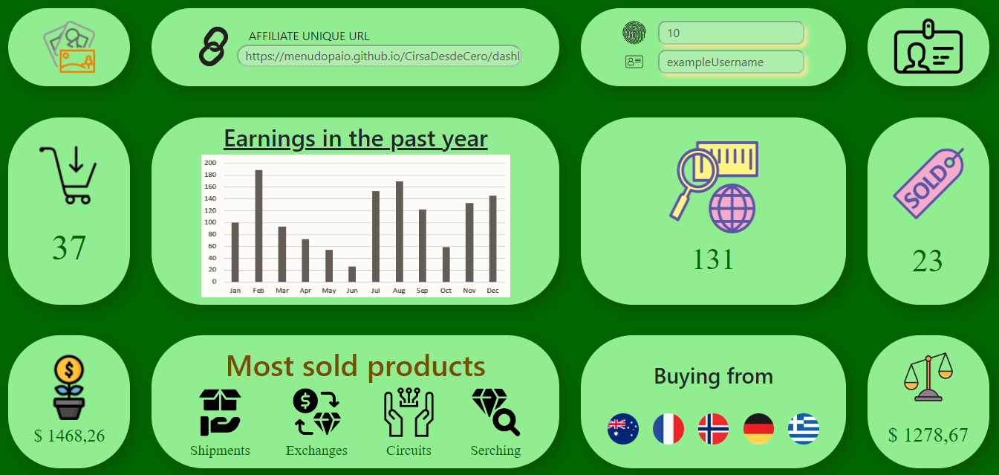
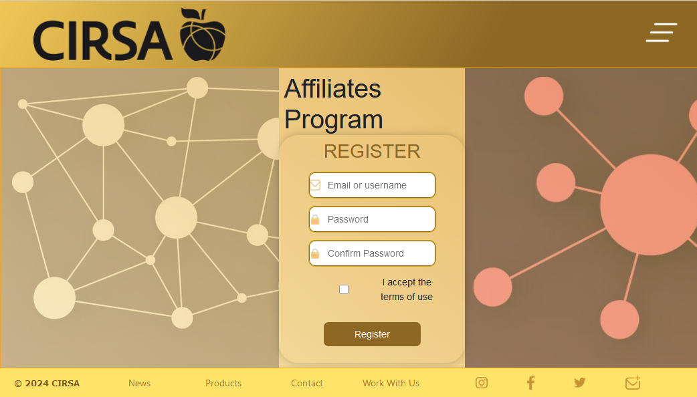
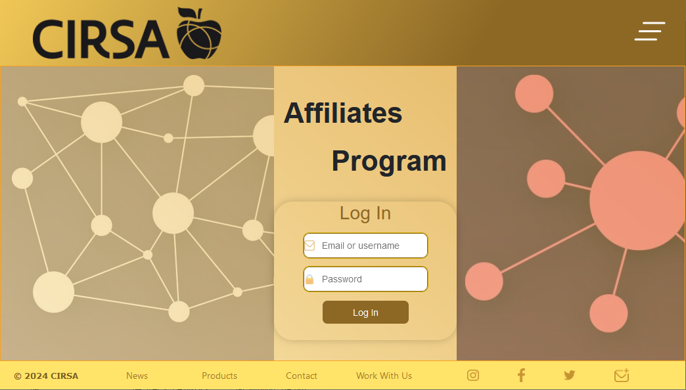

# Cirsa Tech Hub  
## Test Username: exampleUsername  
## Test Password: qwertyuiop  
[https://menudopaio.github.io/CirsaDesdeCero](https://menudopaio.github.io/CirsaDesdeCero)

## TABLE OF CONTENTS:
- [Background](#Background)
- [Installation](#Installation)
   1. [Prerequisites](#Prerequisites)
   2. [Clone the repository](#Clone-the-repository)
   3. [Change the base tag](#Change-the-base-tag)
   4. [Build and run](#Build-and-run)
- [Usage and samples](#Usage-and-samples)

### Background

*CIRSA is looking to expand and has created an affiliate program so that the person who helps can also win. In order to carry it out, capable developers are needed to create an innovative web application with good design. This is why we are asking to create several views that fit CIRSA's design and solve this problem.*

*The stack proposed for this challenge is C# and Blazor as framework.*

I started this webpage with no prior knowledge on .Net or Blazor, but learning to use them was not a big deal. The hardest part of this project has been deploying it succesfully to github pages. It has been an ardous work to realize what was failling; just following the errors couldn't help me, until I found [THE](https://www.youtube.com/watch?v=nNxII6jvPvQ) video.

The main issue with github pages and Blazor applications is that:
1. Github modifies some files when deploying.  
   --> In the root of the project, in the terminal, execute: ` "* binary" >> .attributes `  
   The `.attributes` file will tell github to treat all files as binary files, so it will not modify them.
   
2. Github treats some files as jekyll files.  
   --> In the root directory, create an empty file named `.nojekyll`  
   This will prevent github to treat some autogenerated files as jekyll.

3. The routes are not the same when running on localhost or on github pages.  
   --> In the `<base>` tag in `index.html`, change `("/")` for `("/YourProjectName/")`  
   Github deploys your webpage on `username.github.io/YourProjectName`, so your root is this one, instead.

The last setback I had was creating a workflow. Before this project I even didn't know about their existence. They are very powerfull, but as with anything, you need to know how to use them. I solved this by checking many people's blazor projects to understand what was going on, and also watching many videos (finding the solution again in [THE](https://www.youtube.com/watch?v=nNxII6jvPvQ) same video as before.) All in 16 minutes. The issue was to find it!

For creating a workflow, you need to automate the whole process of what you would do yourself: checkout the branch that contains the project, setup dotnet, install wasm tools, publish it and commit it to github pages using your personal access token. In my case I finally also added to the workflow the creation of the .nojekyll file and the 404 file and the routes issue, as in the video, but it's not needed to automate this.

Since this is a static webpage with no backend, none of the information provided here in any form is going to be stored or processed.

### Installation

To install and run this Blazor WebAssembly project on your local environment, follow these steps:

#### 1. Prerequisites

* Make sure you have the .NET SDK installed on your system. It's recommended to use version 8.0.100 or higher.  
* You'll need a code editor such as Visual Studio Code or Visual Studio to work with the project.

#### 2. Clone the repository

Clone this repository to your local machine using Git:

`git clone https://github.com/menudopaio/CirsaDesdeCero.git`

Enter the root directory of the project.

`cd CirsaDesdeCero`

#### 3. Change the `<base>` tag

In `index.html`, inside `wwwroot`, comment the GITHUB base tag and uncomment the LOCALHOST base tag.

#### 4. Build and run

Open a terminal in the project's root folder and run the following command to build and run the project:

`dotnet run´

This will build the project and run it locally. Once it's up and running, you can access the application from your browser at the provided localhost.

### Usage and samples

From the `Home` page, you can register by either clicking on the `Register` button or by the `Join In` button. In the home page we also find links to some company external departments, such as other products, contact, media, or news. Registering is not possible, but you can use the provided username and password  to log in and check the website functionalities.

Once you log in, you can see a dashboard with some of the information of your account, like your unique affiliate link, how many people registered through your link, your current balance, where is people buying your products from, and other useful information. Of course, all the information is just sample variables, since we cannot access a database from github.

Besides all of your account information, there is a section to edit some styles of your dashboard page. They will also apply to the registration page linked through your affiliate link. Clicking on the top left corner image you can change the font family, color and font weight of some text in your dashboard and the affilliates registration page, as long as the background color of the dashboard and the affiliates registration page, from some dropdown options. You can also edit the greetings text for the registration page. As with any other `form` in github, this will not save the changes.

By clicking on the Check View button, you can see how the client register page is styled.

Or by clicking on the Save button, you can see how the dashboard is combined.

Finally, you can click on the chain icon at the left of your unique affiliate link to copy it to your clipboard, so you can share it with anyone you want. Anyone can register through this new styled page, and buy products making you earn a comission for each sale.  

Some more samples:

Other screen sizes:

